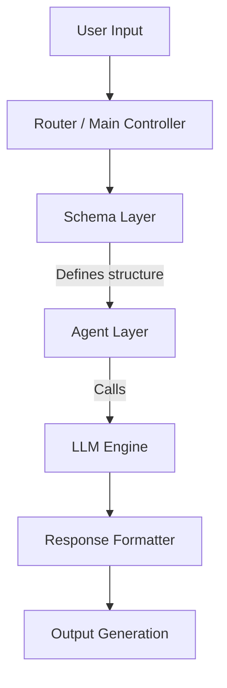
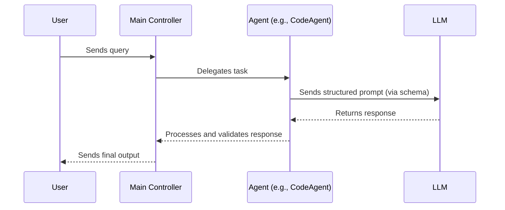
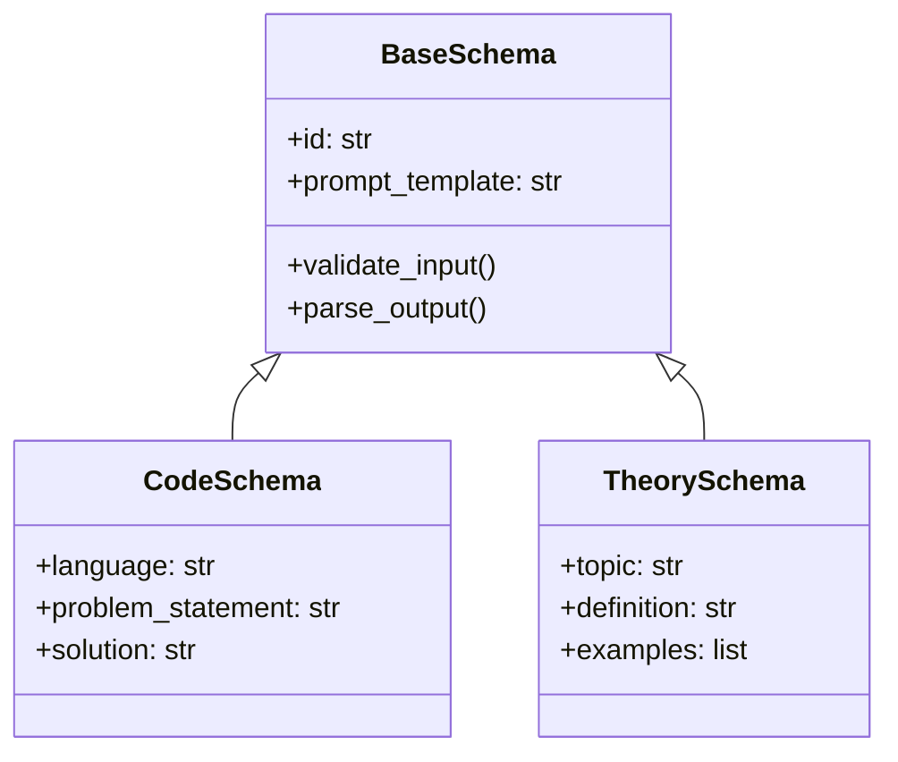

# 🧠 LLM Multi-Agent System

This project is an **LLM-powered multi-agent framework** built with modular schemas and intelligent agents for generating, analyzing, and managing structured knowledge, code, and use cases.

---

## 📁 Project Structure

```
.
├── Schemas/
│   ├── codeSchema.py
│   ├── knowledgeSchema.py
│   ├── theorySchema.py
│   ├── topicSchema.py
│   ├── exampleSchema.py
│   └── useCaseSchema.py
│
├── agents/
│   ├── codeAgent.py
│   ├── knowledgeAgent.py
│   ├── theoryAgent.py
│   ├── topicAgent.py
│   ├── exampleAgent.py
│   └── usecaseAgent.py
│
└── models/
```

Each **Schema** defines the structured input/output format for a specific task type, while each **Agent** uses that schema to interact with an LLM to perform specialized operations.

---

## 🧩 System Architecture



---

## 🤖 Agent Interaction Flow



---

## 🧱 Schema Design



---

## ⚙️ Tech Stack

* **Python 3.10+**
* **LangChain / CrewAI**
* **OpenAI / Gemini API**
* **Pydantic** for schema validation
* **Mermaid.js** for diagrams

---

## 🚀 Setup

```bash
git clone https://github.com/jayanth119/crispy-octo-sniffle.git
cd crispy-octo-sniffle 
pip install -r requirements.txt
```

Run agents:

```bash
python agents/codeAgent.py
```

---

## 🧠 Prompt Engineering Highlights

* Modular prompts for each domain
* Context chaining between agents
* Role-based structured output
* Auto schema validation

---

## ⚠️ Challenges

* Maintaining consistent context across agents
* Balancing creativity vs factual accuracy
* Managing token limits and response length

---

## 📊 Future Work

* Implement feedback-based reinforcement
* Add memory store for long-term context
* Integrate dashboard for agent monitoring

---

**Author:** [Jayanth chukka]
**Project:** `crispy-octo-sniffle`
**License:** MIT
